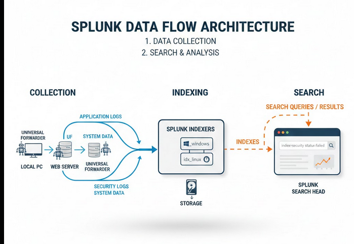
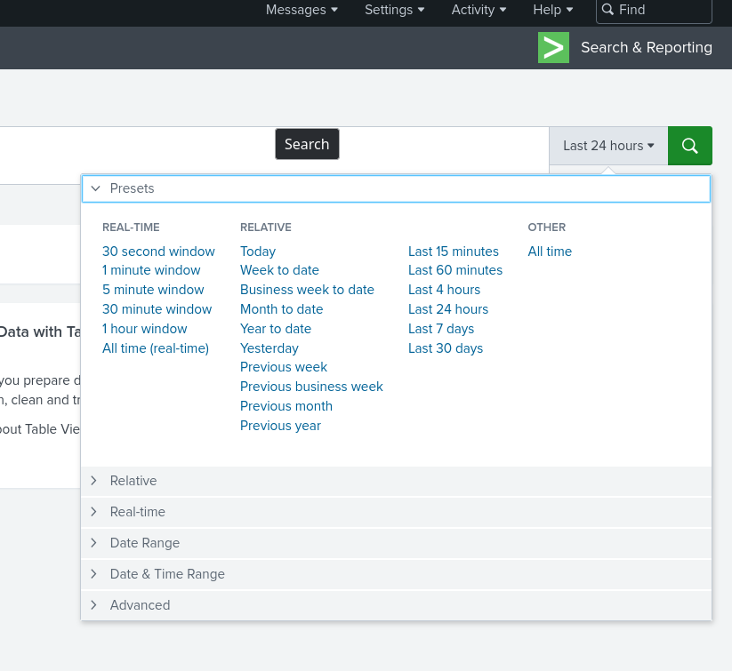
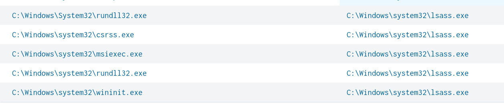
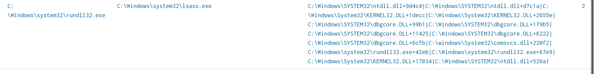
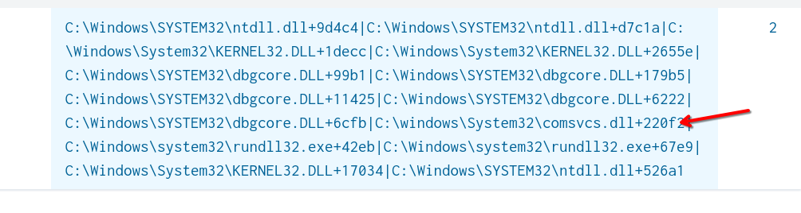
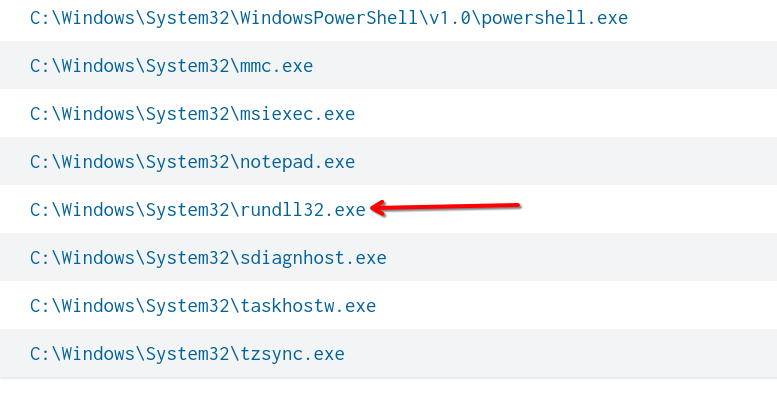
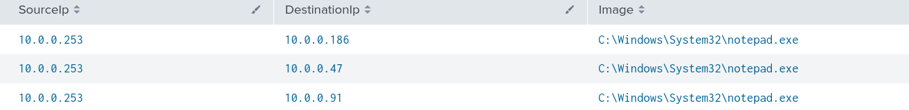

In this lab i will be walking you out through how to detect some attacks in Splunk environment.
Firstly we will need to understand basically what is splunk and basically how does 
Firstly understanding the SIEM architecture of splunk for investigations
Splunk basically has 3 main components -
Forwarders- A Splunk forwarder is a component used to collect data from remote systems and forward it to a Splunk indexer for centralized indexing, storage, and analysis.
So we can basically describe it as something which will basically collect all the application logs, security logs from the endpoints so basically here it may be our local PC, for some big organizations it could be their all components of Active Directory.
In one line it is basically sends the logs to a central for the next of indexing of the logs.
Indexers- These are the next in the handling of the logs. Here we are basically organizing the logs and storing them on the basis of indexes.
For example windows and linux application logs could be managed seperately using different index.
They are basically responsible for processing the search queries from the search heads which we will be discussing now.
Search Heads- These are basically the main application which we interact with where we provide the queries which is then passed to indexers to get the result of the query.



There are more components in like the deployment but these are the main components when you dive deep into how to setup you own SIEM environment you will require them.
**SPL** is the query language used by Splunk for the manipulation of data,searching data and filtering data.

## Splunk Queries
Now we will basically be moving to splunk queries (SPL) as we need SPL in order to interact with the environment.
```
search index="main" 
```
Note: The search command is basically implicit so we need not worry about typing in the search head 
Now suppose the index=main is basically containing our logs or we can use 
```
index=* 
```
if we want to search for all indexes
Now we can basically run this query in order to fetch the whole log data
We basically do not need as this makes no sense to us to manually read everything everything in this ocean of logs for any potential threats so we will basically be using some log sources
```

index="main" sourcetype="WinEventLog:Sysmon" EventCode!=1
```
So basically here i am fetching for sysmon logs from the source and i am using != 
for not including the event which are basically of id_no 1 (This is basically process creation event)
More information about Sysmon and event IDs here- https://learn.microsoft.com/en-us/sysinternals/downloads/sysmon

Splunk (SPL)basic queries cheatsheet
https://www.stationx.net/splunk-cheat-sheet/
Now I will be moving to some basic Table generation queries in splunk
```
index="main" sourcetype="WinEventLog:Sysmon" EventCode=1 | table _time, host, Image
```
Now as a addition here we are using basic  'time' here for displaying the time and host for the host system and image for basically the process


## Detection
Let us imagine a scenario for Unauthorized LSASS Dumping and C2 Callback Activity for a given time frame 
Note: This is a very basic lab for understanding the attacks in real you will be not be knowing exactly what happen you may just see some alerts in some SIEM solution 
The timings need to be adjusted as to what you were reported that event
For changing the timings 



You can just do by clicking on top right corner where it displays last 24hrs
1 Firstly we are provided lsass so we are possibly looking at some credential dumping scenerio and maybe also connection establish using C2 server but we need to investigate basically what could have happened.
2 First of all we know there is some unexpected activity involving so let's start with that .
3 We will basically be using the query
```
index=* sourcetype="WinEventLog:Sysmon" EventCode=10 lsass.exe 
| stats count by SourceImage,TargetImage
```
If i try breaking down this query this query this is basically looking some event with EventCode=10 which basically means a process is basically executing some other process and the purpose of writing lsass.exe is that we are given there was basically some activity related to this. 
Now for the stats argument we are basically using a statistics function to count by SourceImage and TargetImage where baiscally Image is some process this is basically some naming convention i believe which splunk uses 
For the part of index=* and sourcetype i have already explained it earlier in this blog.

So we should now basically look for some suspicious processes which are initializing the service lsass.exe .



here we are basically seeing rundll32 basically appearing twice this leads to some suspicion why this service is calling the process two times
4 Upon some googling we find that 
`rundll32.exe` is **frequently abused** in LSASS dumping attacks via LOLbins
so we need to deeply investigate incidents related to this to check if it is actually malicious or maybe it just something else.
5 Now moving forward in our investigation we will basically be running this query
```
index=* sourcetype="WinEventLog:Sysmon" EventCode=10 SourceImage="C:\\Windows\\System32\\rundll32.exe"
| stats count by SourceImage,TargetImage,CallTrace
```
Now what this query is doing is almost same as earlier but we have changed the parent process in the query parameter SourceImage as rundll32 so we can see what processes rundll32 has executed and the purpose of having Calltrace is getting info about what were the dlls called for the execution
6 This is the info we have about these now .



Upon analyzing the calltrace we see that 

 

of all the dlls one dll is quite a common surface of living off the land binaries attacking method even though it itself is legitimate process it is used for dumping the memory of another process.
So now the compromise is quite high 
7 Now we have a hint of process we will now proceed on to check for the running of some malicious powershell scripts in the system.
8 Now we will basically be looking for clr.dll which is normally a fully legitimate process but is often utilized for LOL binaries which are often used for fileless malware they just some heavily obfuscated powershell scripts which often utilize clr.dll   
```
index="main" EventCode=7 ImageLoaded="*clr.dll" 
| stats count by Image
```
Got the process here



Now we have successful indications that the malware was able to get into our system our one of system of our organization.
8 Now what we should be looking is something like C2 communication as we have some malware our system that just was just using lsass.exe for credential dumping so it must be trying to connect to some remote server for the communication or even worse action like trying to get some rce .
9 Now we will be looking closely at the time frame of the attack and basically trying to see the traffic within that time for any C 2 indications
```
index=main sourcetype="WinEventLog:Sysmon"  EventCode=3 
| stats count by SourceIp,DestinationIp,Image
```
We can utilize this query for getting our sysmon logs for network activities
and we are printing statistics counted by sourceIP,DestIP and Image
Here of all the processes the notepad is suspicious rest all was normal traffic
So basically the obfuscated powershell script was basically utlilizing notepad for the C2 communication 



Now since we have investigated events
Our possible next steps
1 Blocklisting the IPs
2 Isolating the affected PC from the internet 
3 Taking potential ram dumps and registry dump so as to check its persistence mechanisms.
4 Take a full forensic image of the computer for the further analysis.
5 Creating a timeline of events and checking further maybe the start was just a employee who a million dollars in a lottery and wanted to confirm by just downloading a file or any other event.
